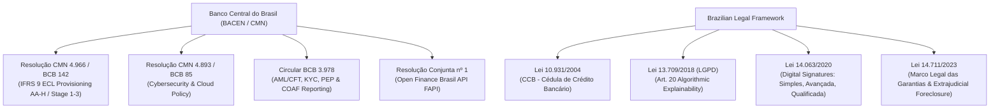
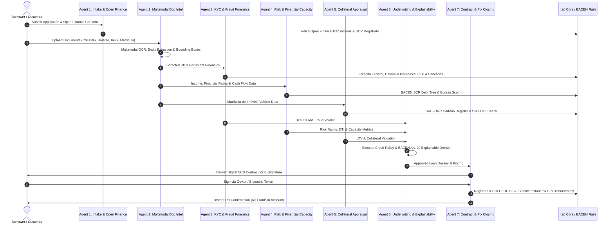

# Banco Itaú Loan Origination & Autonomous Agent Processing: Research Synthesis

## Executive Summary

This research document analyzes Banco Itaú Unibanco's loan portfolio, the Brazilian regulatory and banking verification ecosystem (BACEN, LGPD, Open Finance Brasil, SCR Registrato, Receita Federal, CERC/B3, Pix), and details how Google Cloud Platform (GCP) and the **Gemini Enterprise Agent Platform (fka Vertex AI Platform)** transform end-to-end credit origination.

---

## 1. Banco Itaú Loan Product Portfolios & Offerings

### 1.1 Retail Loans (Pessoa Física - PF)

| Loan Product | Target Profile & Purpose | Key Collateral / Security | Tenor & Limits | Evaluation Metrics | Key Document Requirements |
| :--- | :--- | :--- | :--- | :--- | :--- |
| **Crédito Pessoal (CDC / LIS)** | Fast liquidity for general consumer use, debt consolidation (*Sob Medida*) | Unsecured (*Clean*) | 1–72 months; pre-approved up to R$ 100k+ | DTI $\le 30-35\%$, Bureau score (Serasa/Quod), BACEN SCR history | RG/CNH, CPF, Comprovante de Residência, Holerite/Extrato |
| **Crédito Consignado** | INSS retirees/pensioners, SIAPE civil servants, private CLT employees | Automatic payroll deduction (Law 10.820/2003) | Up to 84–96 months; rate capped by INSS/CNPS | *Margem Consignável* (35% loan + 5% RMC + 5% RCC) | RG/CNH, CPF, Contracheque/Extrato INFBEN, SouGov/Dataprev token |
| **Financiamento Imobiliário** | Home acquisition, residential & commercial properties | *Alienação Fiduciária em Garantia* (Law 9.514/1997) | Up to 360–420 months; SFH ($\le$ R$ 1.5M) vs SFI | LTV $\le 80\%$ (SFH) / $70\%$ (SFI), DTI $\le 30\%$ gross income (SAC/Price) | RG/CNH, IRPF+Recibo, Holerites, Matrícula de Imóvel (RGI), CNDs, ITBI |
| **Financiamento de Veículos** | New and pre-owned car acquisition | *Alienação Fiduciária* (SNG / DETRAN lien) | 12–60 months; down payment 10–30% | LTV $\le 70-90\%$ of Tabela FIPE, Credit rating | RG/CNH, CPF, Comprovante de Renda, Documento do Veículo (CRV/CRLV) |
| **Crédito com Garantia de Imóvel (CGI / Home Equity)** | Low-cost, long-term liquidity for business, debt restructuring, or investment | 1st-degree *Alienação Fiduciária* on unencumbered property | Up to 180–240 months; from R$ 50k to R$ 5M+ | LTV $\le 50-60\%$ of appraised value, DTI $\le 30-35\%$ | Matrícula de Inteiro Teor (RGI), IPTU, Certidões Negativas, IRPF, Holerites |
| **Antecipação de FGTS (Saque-Aniversário)** | Immediate liquidity without monthly installments | Pledged future FGTS Saque-Aniversário annual tranches | 1–10 years of tranches; paid directly by Caixa to Itaú | Locked FGTS balance; no bureau score restriction | CPF, CNH/RG, Caixa FGTS App authorization token |

### 1.2 Commercial / Business Loans (Pessoa Jurídica - PJ)

| Loan Product | Target Profile & Purpose | Key Collateral / Security | Evaluation Metrics | Key Document Requirements |
| :--- | :--- | :--- | :--- | :--- |
| **Capital de Giro (Working Capital)** | Cash flow, inventory, payroll, operational liquidity | Fiança / Aval dos Sócios; FGO (PRONAMPE), FGI PEAC (BNDES) | DSCR / ICSD $\ge 1.25\text{x}$, Net Debt/EBITDA $\le 3.0\text{x}$, SCR 3040 | Contrato Social / QSA, Balanço Patrimonial, DRE, PGDAS-D, Extrato 12m |
| **Antecipação de Recebíveis** | Liquidity against credit card sales & commercial invoices (*Duplicatas*) | Pledged *Unidades de Recebíveis* (URs) in CERC, TAG, B3 | Historic chargeback rate, invoice validity, merchant volume | XML das NF-e, Comprovantes de Entrega, Central de Recebíveis token |
| **Financiamento de Equipamentos (BNDES / FINAME)** | Industrial machinery, vehicle fleets, solar panels, agricultural equipment | Alienação Fiduciária of equipment + FINAME registration | Cash flow debt service capacity, environmental compliance | Código FINAME/CFI, CND Federal, CRF FGTS, Licença Ambiental |
| **Crédito Rural / Agro (CPR)** | Crop financing (*Custeio*), machinery, farm expansion | *Penhor Agrícola*, Land Mortgage, *Patrimônio de Afetação Rural* | Agronomic feasibility (ZARC), NDVI satellite telemetry, ESG socio-environmental check | Matrícula CAR (Cadastro Ambiental Rural), Outorga de Água, CPR issuance |

---

## 2. Brazilian Banking Regulatory & Processing Ecosystem

### 2.1 Core Regulatory Framework



1. **Credit Risk & Loss Provisioning (Resolução CMN 4.966/2021 & BCB 142/2021)**:
   - Regulates credit classification from historical 9-tier rating (`AA` [0%], `A` [0.5%], `B` [1%], `C` [3%], ..., `H` [100%]) to IFRS 9 Expected Credit Loss (ECL / *Perda Esperada*) 3-Stage framework:
     - **Stage 1 (Performing)**: 12-month expected loss ($ECL = PD_{12m} \times LGD \times EAD \times DF$).
     - **Stage 2 (Underperforming / Watchlist)**: Significant increase in credit risk (SICR) $\rightarrow$ Lifetime ECL.
     - **Stage 3 (Credit-Impaired / Default)**: $>90$ days overdue $\rightarrow$ Lifetime ECL.
2. **Cybersecurity & Cloud Infrastructure (Resolução CMN 4.893/2021)**:
   - Requires zero-trust segmentation, data encryption in transit (TLS 1.3) and at rest (Cloud KMS / HSM), audit logging (CADOC), and operational business continuity.
3. **AML/CFT & KYC (Circular BCB 3.978/2020 & Carta-Circular 4.001/2020)**:
   - Mandatory Risk-Based Approach (ABR), PEP screening (Pessoas Expostas Politicamente + relatives up to 1st degree + corporate entities), adverse media, slave labor blacklist (*Lista Suja do MTE*), and SISCOAF transaction alerting.
4. **LGPD (Lei Geral de Proteção de Dados - Lei 13.709/2018)**:
   - Legal bases: *Proteção do Crédito* (Art. 7, X) and *Execução de Contrato* (Art. 7, V).
   - **Article 20 (Right to Explanation)**: Mandates that borrowers have the right to request human review and transparent, explainable criteria for automated credit decisioning without black-box opacity.
5. **Electronic CCB & Financial Asset Registrars (Lei 10.931/2004 & BCB Res. 105/2021)**:
   - The *Cédula de Crédito Bancário* (CCB) is an extrajudicial title. Electronic CCBs are registered in centralized registrars (**CERC, B3, CIP, TAG**) to ensure single-pledge uniqueness (*trava bancária*) and prevent duplicate encumbrance.
6. **Settlement Rails**:
   - **Pix (SPI / DICT - BACEN)**: Real-time gross settlement 24/7/365 via ISO 20022; instant loan disbursement upon CCB signature.

---

## 3. End-to-End Processing Workflow (8 Stages)



---

## 4. Google Cloud & Gemini Multi-Agent Architecture

```
+-------------------------------------------------------------------------------------------------------------------------------+
|                                      GEMINI ENTERPRISE MULTI-AGENT SPECIFICATION                                              |
+--------+------------------------------------+--------------------------+------------------------------------------------------+
| Agent  | Specialized Agent Name             | Model / Engine           | Responsibilities & Tools                             |
+--------+------------------------------------+--------------------------+------------------------------------------------------+
| A1     | Intake & Conversational Assistant  | `gemini-3.7-flash`       | Intent parsing, Open Finance OAuth, intake validation|
| A2     | Document Intelligence Agent        | `gemini-3.7-flash`       | 2D bounding boxes, cross-doc income/PII verification |
| A3     | KYC, Fraud & Compliance Agent      | `gemini-3.7-flash`       | ELA forensics, Receita Federal, PEP, Datavalid biomet|
| A4     | Credit Risk & Financial Capacity   | `gemini-3.7-flash`       | SCR Registrato parsing, DTI, IFRS 9 ECL rating (AA-H)|
| A5     | Collateral & Legal Appraisal Agent | `gemini-3.7-flash`       | Matrícula RGI legal title check, AVM valuation, LTV  |
| A6     | Underwriting & Explainability      | `gemini-3.7-flash`       | Master synthesis, BACEN Art. 20 Portuguese dossier   |
| A7     | Contract & Closing Agent           | `gemini-3.7-flash`       | Statutory CCB generation, digital sign, Pix SPI wire |
+--------+------------------------------------+--------------------------+------------------------------------------------------+
```

### Google Cloud Infrastructure Stack
* **Compute**: Google Cloud Run (Serverless, scales to zero when idle, max 3 instances for demo).
* **AI Orchestration**: Gemini Enterprise Agent Platform (fka Vertex AI Platform) (`google-genai` SDK with ADC authentication, zero hardcoded API keys).
* **Backend**: Python FastAPI with Server-Sent Events (SSE) / WebSockets for streaming agent reasoning traces.
* **Frontend**: React + Vite + Tailwind CSS + Shadcn UI, adhering strictly to the Banco Itaú Design System (`#FF6423`, `#070707`, `#F3F3F3`, Swiss minimalism, 4px button radius, zero emojis).
* **Security**: Google Cloud Secret Manager, Cloud IAM least privilege (`<app-name>-sa`), Identity-Aware Proxy (IAP) with backend JWT verification.
