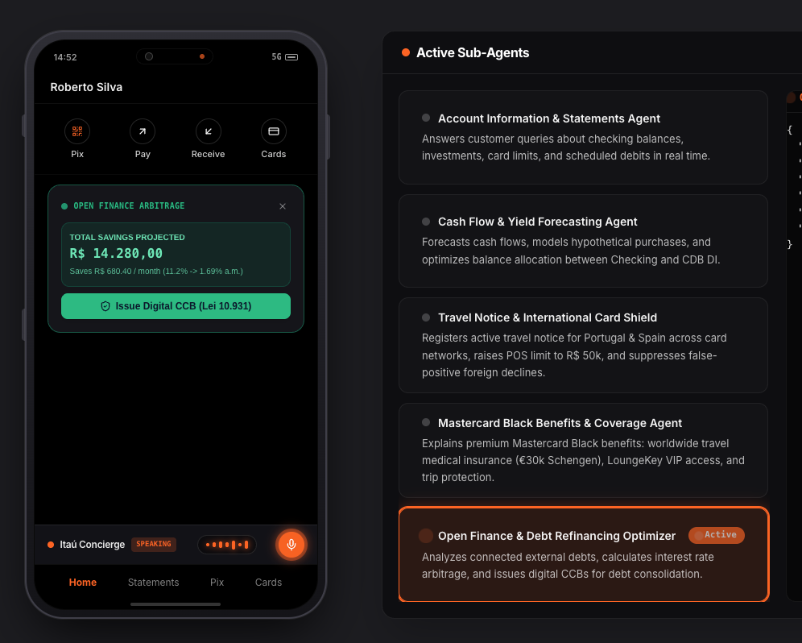
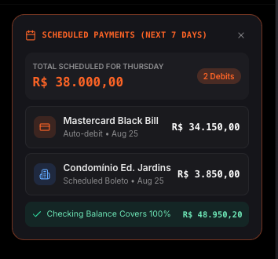
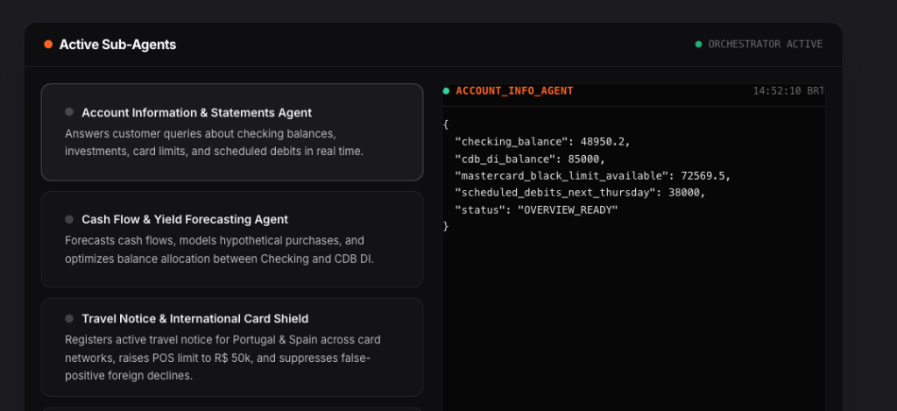

# Banco Itaú — Central de Segurança & Alertas Bancários

An intelligent, real-time banking security and proactive alerts platform for **Banco Itaú Unibanco**, built with **Gemini Enterprise Agent Platform (fka Vertex AI Platform)**, **Python FastAPI**, **React 19**, **Vite**, and **Tailwind CSS**. Deployed securely on **Google Cloud Run** with native **Identity-Aware Proxy (IAP)**.

---

## Screenshots & Interface Overview

### 1. Multi-Agent Banking Cockpit & Mobile Shell


### 2. Scheduled Payments & Debits Itemized Breakdown


### 3. Sub-Agent Telemetry & JSON Schema Inspector


---

## Executive & Architectural Overview

The **Itaú Banking Alerts Platform** coordinates proactive financial intelligence and security resolution through a high-performance, dual-engine AI architecture:

1. **Gemini Live Multimodal WebSocket API** (`gemini-3.5-flash-live-preview`):
   - **Real-Time Voice Streaming**: Bidirectional 16kHz PCM microphone audio streaming and low-latency 24kHz audio synthesis (`Aoede` persona).
   - **Autonomous Function Calling**: Sub-second dispatching of banking sub-agents (`get_account_info`, `sweep_cdb`, `activate_travel_mode`, `get_card_benefits`, `refinance_open_finance`).
2. **Gemini Enterprise Agent Platform REST API** (`gemini-3.7-flash`):
   - **High-Order Analytical Reasoning**: Deep JSON schema validation, risk evaluation, and multi-turn financial decisioning.

```
       [ Itaú Cardholder (Browser/Mobile) ]
                        │
                        ▼  (IAP Protected / X-Goog-IAP-JWT-Assertion)
        ┌────────────────────────────────────────────────────────┐
        │                    Google Cloud Run                    │
        │              (FastAPI Backend + React UI)              │
        └──────────────┬──────────────────────────┬──────────────┘
                       │                          │
           (Sub-Agent Tool Triggers)   (Bidirectional Live Audio / REST)
                       │                          │
                       ▼                          ▼
        ┌──────────────────────────┐   ┌────────────────────────────────┐
        │      Itaú Guard AI       │   │    Gemini Enterprise Agent     │
        │     Decision Graph       │   │         Platform (ADC)         │
        │    (BACEN MED Rules)     │   │ • Live: gemini-3.5-flash-live- │
        └──────────────────────────┘   │         preview                │
                                       │ • REST: gemini-3.7-flash       │
                                       └────────────────────────────────┘
```

---

## Design System & Look & Feel (DESIGN.md)

The user interface follows the high-contrast corporate financial design system specified in [`DESIGN.md`](file:///Users/alexcombs/Projects/itau-banking-alerts/DESIGN.md):
- **Brand Colors**: Itaú Signature Orange (`#FF6423`), Pitch-Black Hero (`#070707`), Off-White Body (`#F3F3F3`), Text Muted (`#798B97`).
- **Hero Section**: 12-column responsive layout with 24px gutters, quarterly result announcements, and translucent quick-link cards (`rgba(0,0,0,0.4)` with 1px hairline borders).
- **Buttons & Cards**: 4px subtle rounded buttons (`--radius-button: 4px`), 8px cards (`--radius-card: 8px`). No pill buttons.
- **Typography**: Google Font `Arimo` across dynamic cards and Swiss typographic layout.
- **Iconography**: Exclusively stroke-based SVG icons via `lucide-react` (zero emojis in UI copy or documentation).

---

## Quick Start (Local Development)

### 1. Prerequisites
- Python 3.11+
- Node.js 20+ / npm
- Google Cloud SDK (`gcloud auth application-default login`)

### 2. Configure Environment
```bash
cp example.env .env
```

### 3. Run Locally with Parity
```bash
chmod +x run_local.sh
./run_local.sh
```
- **Unified App (FastAPI + SPA)**: [http://127.0.0.1:8090](http://127.0.0.1:8090)
- **Frontend Vite Dev Server (HMR)**: [http://127.0.0.1:5173](http://127.0.0.1:5173)
- **Interactive Walkthrough Manual**: [http://127.0.0.1:8090/walkthrough.html](file:///Users/alexcombs/Projects/itau-banking-alerts/walkthrough.html)
- **Executive Demo Script**: [http://127.0.0.1:8090/demo_script.html](file:///Users/alexcombs/Projects/itau-banking-alerts/demo_script.html)

---

## Google Cloud Run Deployment

Deploy securely to Google Cloud Run using the standardized, automated deployment script:

```bash
chmod +x deploy.sh
./deploy.sh
```

### Security & Native IAP Architecture
1. **Authentication Configuration**:
   - **IAM (Service-to-Service)**: **Disabled / Unchecked** (`--no-invoker-iam-check`) so browser end-users do not require `roles/run.invoker`.
   - **IAP (Browser End-Users)**: **Enabled / Checked** (`--iap`) with `domain:google.com` (or specified domain) programmatically bound to the Cloud Run IAP resource policy.
2. **IAP Allowed Domains Requirement**:
   - The Cloud Run service URL/domain is automatically added under **Allowed Domains** in the IAP Settings panel to authorize OAuth redirects.
3. **Project IAM Policy Compliance**:
   - `domain:google.com` is **NEVER added to GCP Project-level IAM roles** (preventing Domain Restricted Sharing / DRS Org Policy violations).
4. **Backend JWT Verification**:
   - FastAPI enforces cryptographically verified `X-Goog-IAP-JWT-Assertion` headers matching `IAP_ALLOWED_DOMAINS` in production (`iap_jwt_middleware.py`).

---

## Automated Teardown

To clean up all Cloud Run and Service Account resources created by this demo:

```bash
chmod +x destroy.sh
./destroy.sh
```

---

## Key File Directory

| File / Path | Role & Purpose |
| :--- | :--- |
| [`main.py`](file:///Users/alexcombs/Projects/itau-banking-alerts/main.py) | FastAPI backend, Gemini client, banking endpoints, and strict cache-control SPA static asset serving. |
| [`iap_jwt_middleware.py`](file:///Users/alexcombs/Projects/itau-banking-alerts/iap_jwt_middleware.py) | Cryptographic IAP JWT verification and domain allowlist enforcement. |
| [`DESIGN.md`](file:///Users/alexcombs/Projects/itau-banking-alerts/DESIGN.md) | Authoritative Itaú brand tokens, high-contrast hero specifications, and UI rules. |
| [`frontend/src/App.tsx`](file:///Users/alexcombs/Projects/itau-banking-alerts/frontend/src/App.tsx) | Main React layout composing the Cockpit Header, Mobile Shell, Sub-Agent Orchestrator, and Telemetry. |
| [`frontend/src/components/PhoneContainer.tsx`](file:///Users/alexcombs/Projects/itau-banking-alerts/frontend/src/components/PhoneContainer.tsx) | Interactive mobile device container with Personnalité account, balance toggle, and dynamic card canvas. |
| [`frontend/src/components/AgentOrchestratorPanel.tsx`](file:///Users/alexcombs/Projects/itau-banking-alerts/frontend/src/components/AgentOrchestratorPanel.tsx) | Real-time multi-agent orchestrator panel showing active sub-agents and live JSON telemetry. |
| [`frontend/src/components/VoiceBankingModal.tsx`](file:///Users/alexcombs/Projects/itau-banking-alerts/frontend/src/components/VoiceBankingModal.tsx) | Multimodal voice & chat AI assistant powered by Gemini 3.7 Flash. |
| [`deploy.sh`](file:///Users/alexcombs/Projects/itau-banking-alerts/deploy.sh) | Cloud Run build and deployment script with IAP and Service Account automation. |
| [`destroy.sh`](file:///Users/alexcombs/Projects/itau-banking-alerts/destroy.sh) | Automated resource cleanup script. |
| [`run_local.sh`](file:///Users/alexcombs/Projects/itau-banking-alerts/run_local.sh) | Local development runner with 127.0.0.1 host binding. |
| [`walkthrough.html`](file:///Users/alexcombs/Projects/itau-banking-alerts/walkthrough.html) | ASD-STE100 interactive application walkthrough manual for Developers and Executives. |
| [`demo_script.html`](file:///Users/alexcombs/Projects/itau-banking-alerts/demo_script.html) | High-fidelity interactive script for executive presentations and customer walkthroughs. |

